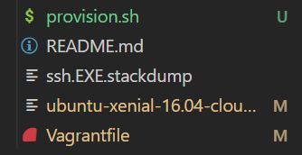
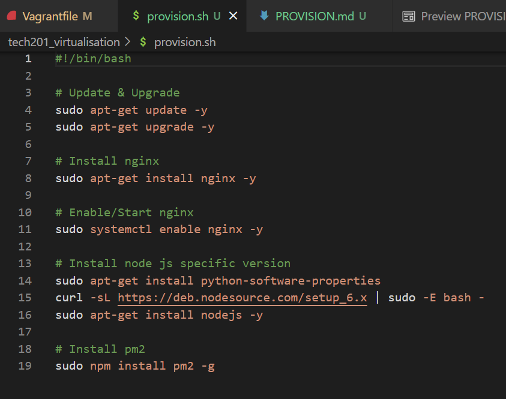
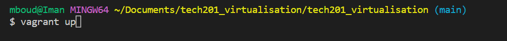
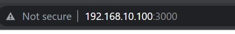
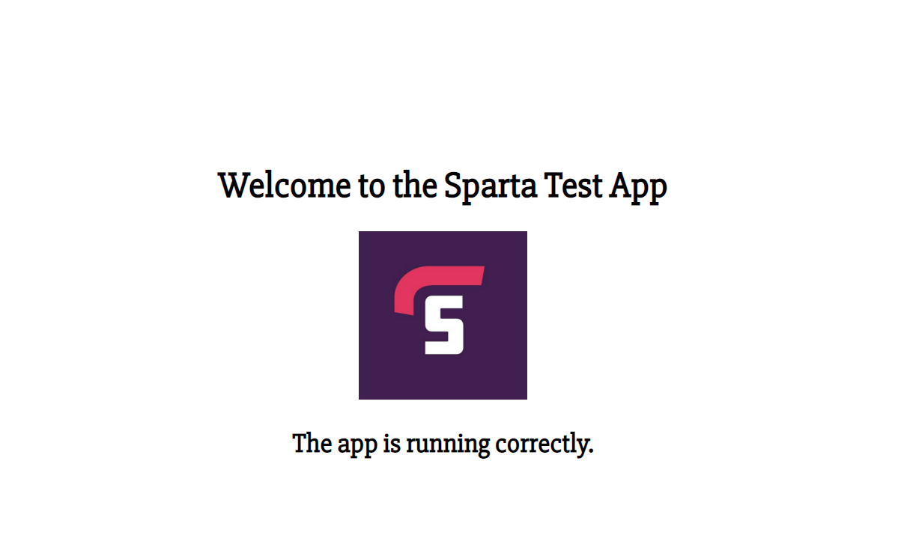

# Step by step guide on how to provision

## Step 1 
- Create a shell file in the same directory as you vagrant files, calling it `provision.sh`
- 

## Step 2
- Include all the code to update, upgrade tools and to also install all the necessary dependencies for the app.
- 

## Step 3
- Now go onto `git bash` and enter the command `vagrant up` so that our script can begin to execute.
- 

## Step 4
- Go into you virtual machine by entering `vagrant ssh`, cd into the app folder, and enter the command `npm install` and `node app.js` to start the app. Then go onto your brower and enter `192.168.10.100:3000` to access the app.
- 
- 